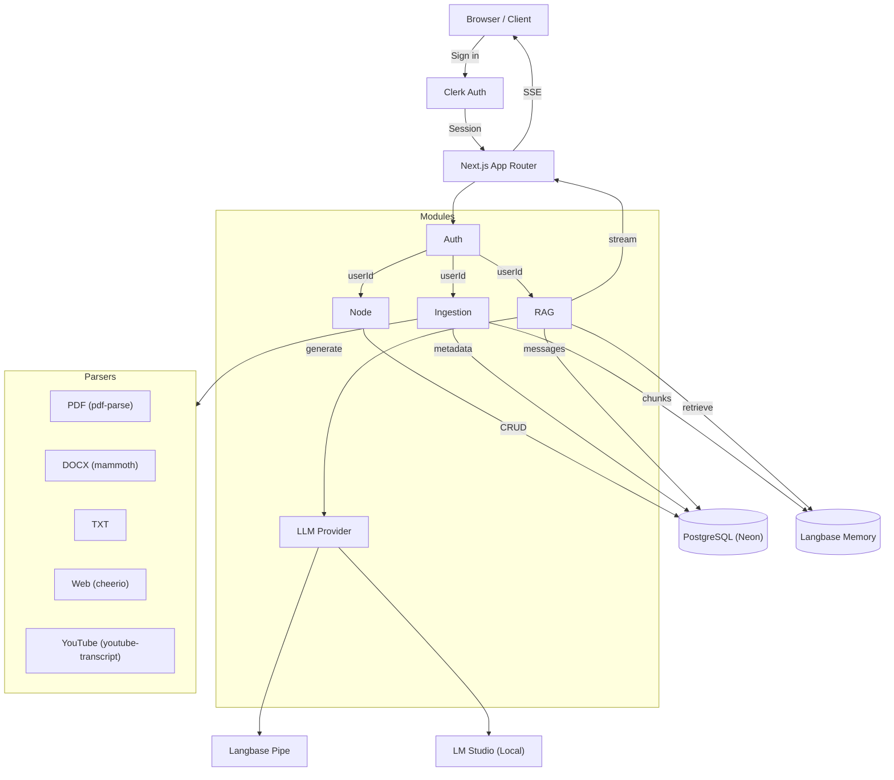

# Psynapse

[](https://www.typescriptlang.org)
[](https://nextjs.org)
[](https://docker.com)

> LLM-powered node-based platform for document Q&A, summarization, and knowledge management. Upload PDFs, scrape web pages, fetch YouTube transcripts — then ask questions in natural language and get streaming answers with source citations.

---

## Features

- **Multi-format ingestion** — PDF, DOCX, TXT, CSV, MD, HTML, XLSX, web pages, and YouTube transcripts. Each format has a dedicated parser with paragraph-aware chunking.
- **Streaming chat** — Real-time SSE responses from Langbase Pipes (or local LM Studio) with markdown rendering and inline citation chips.
- **Per-node knowledge bases** — Organize sources into named nodes. Each node has its own conversation history and vector index.
- **Smart summaries** — Generate structured study guides or FAQ documents from all sources in a node with one click.
- **Source management** — Sidebar with status badges, live search/filter, raw text preview, and delete confirmation.
- **Source citations** — Every answer includes bracketed references to the source documents it used. Inline `[1]`, `[2]` markers are rendered as styled superscript chips.
- **Local LLM support** — Auto-detects LM Studio at runtime. If a local instance is available, it's used instead of Langbase Pipe for inference.
- **Authentication** — Clerk-powered auth with sign-in/sign-up pages, middleware-guarded routes, and server-side session validation.
- **Rate limiting** — Sliding-window rate limiter (30 req/min chat, 10 req/min summarize) per user.
- **Landing page** — Full marketing landing page (hero, features, how-it-works, CTA) for unauthenticated visitors.
- **Mobile responsive** — Collapsible sidebar with Sheet drawer and bottom sources panel for smaller screens.

---

## Architecture

The project follows a **modular monolith** pattern: a single Next.js deployable with five internal modules that communicate through clean interfaces. Each module can be extracted into a standalone microservice later without rewriting.



**Data flow:**

1. User signs in via Clerk. Session is validated on every request by the auth module.
2. User creates a node → stored in PostgreSQL.
3. User adds a source (file upload or URL) → the ingestion module selects the correct parser, extracts text, chunks it (~4KB paragraph-boundary splits), uploads each chunk to Langbase Memory (vector store), and records metadata in PostgreSQL.
4. User sends a message → the RAG module retrieves the top-4 relevant chunks from Langbase Memory, builds a system prompt with chunks + conversation history, streams the LLM response back to the client via SSE, and persists the conversation.
5. LLM inference is routed through the LLM provider module — auto-detects LM Studio (local) if available, otherwise falls back to Langbase Pipe.
6. User requests a summary → the RAG module collects all ready source texts, builds a study-guide or FAQ prompt, and runs it through the LLM provider.

---

## Getting Started

> [!PREREQUISITES]
>
> - Node.js 20+
> - npm
> - A [Neon](https://neon.tech) PostgreSQL database (free tier works)
> - A [Langbase](https://langbase.com) account with an API key
> - A [Clerk](https://clerk.com) application (free tier works)

### 1. Clone and install

```bash
git clone https://github.com/yourusername/psynapse.git
cd psynapse
npm install
```

### 2. Configure environment

Copy the example env file and fill in your credentials:

```bash
cp .env.example .env
```

```
LANGBASE_API_KEY=lb_...
DATABASE_URL=postgresql://...
NEXT_PUBLIC_CLERK_PUBLISHABLE_KEY=pk_...
CLERK_SECRET_KEY=sk_...
```

> [!TIP]
> All four services have free tiers. Total cost for personal use: **$0**.

### 3. Initialize the database

```bash
npm run db:push
```

This creates the `nodes`, `sources`, and `chat_messages` tables via Drizzle ORM.

### 4. Start the dev server

```bash
npm run dev
```

Open [http://localhost:3000](http://localhost:3000). Unauthenticated visitors see the landing page. Sign in with Clerk, create a node, upload a document, and start asking questions.

---

## Usage

### Creating a node

From the dashboard, click **New node** in the sidebar, give it a name, and select it to open the node view.

### Adding sources

| Source type | How to add |
|---|---|
| **PDF / DOCX / TXT** | Click **File** in the sources panel and select your document |
| **Web page** | Click **URL**, paste a page URL |
| **YouTube video** | Click **URL**, paste a YouTube link — the transcript is extracted automatically |

Sources appear in the sidebar with status badges: `pending` → `processing` → `ready` / `failed`. You can filter them by name, click to preview raw text, or remove with the delete button (confirmation dialog shown).

### Chatting

Type a question in the input field and press Enter. The response streams in real-time with markdown formatting and inline citation chips like `[1]`, `[2]`. A **Sources** section below each answer lists the documents that contributed.

### Generating summaries

Click **Study Guide** or **FAQ** in the sources panel to generate a structured summary from all ready sources in the node.

### Local LLM (LM Studio)

If you run [LM Studio](https://lmstudio.ai) locally (default `http://localhost:1234`), the LLM provider module auto-detects it on first request and routes inference there instead of Langbase Pipe. Set `LM_STUDIO_URL` in your env to change the endpoint.

---

## Project Structure

```
psynapse/
├── app/                              # Next.js App Router
│   ├── globals.css                   # CSS custom properties, citation styles, grain overlay
│   ├── layout.tsx                    # Root layout (ClerkProvider, fonts)
│   ├── page.tsx                      # Landing page (redirects if authenticated)
│   │
│   ├── _components/
│   │   └── landing/                  # Landing page sections
│   │       ├── hero.tsx
│   │       ├── features.tsx
│   │       ├── how-it-works.tsx
│   │       ├── cta.tsx
│   │       └── footer.tsx
│   │
│   ├── (dashboard)/                  # Authenticated route group
│   │   ├── layout.tsx                # Dashboard layout (sidebar, mobile drawer)
│   │   ├── actions.ts                # Server Actions (node CRUD, sources, summaries)
│   │   ├── page.tsx                  # "Select a node" placeholder
│   │   ├── _components/
│   │   │   └── node-list.tsx         # Sidebar node list
│   │   └── nodes/
│   │       ├── page.tsx              # "/nodes" placeholder
│   │       └── [nodeId]/page.tsx     # Main chat + source management UI
│   │
│   ├── api/
│   │   ├── chat/route.ts             # Streaming SSE endpoint (rate-limited)
│   │   ├── summarize/route.ts        # Summary generation endpoint
│   │   └── health/route.ts           # Health check for Docker/K8s probes
│   │
│   └── sign-in/
│       └── [[...sign-in]]/page.tsx   # Clerk sign-in page
│
├── components/
│   ├── error-boundary.tsx            # React error boundary
│   └── ui/                           # shadcn/base-nova primitives
│       ├── badge.tsx, button.tsx, card.tsx, dialog.tsx
│       ├── input.tsx, label.tsx, scroll-area.tsx
│       ├── select.tsx, separator.tsx, sheet.tsx, textarea.tsx
│
├── lib/
│   ├── config.ts                     # Global constants (memory, pipe, model names)
│   ├── env.ts                        # Env var validation
│   ├── langbase.ts                   # Langbase client singleton
│   ├── rate-limit.ts                 # In-memory sliding-window limiter
│   ├── utils.ts                      # cn() utility (clsx + tailwind-merge)
│   └── db/
│       ├── schema.ts                 # Drizzle PostgreSQL schema
│       ├── index.ts                  # Database connection (Neon serverless)
│       └── migrations/               # Generated SQL migrations
│
├── modules/                          # Domain modules (modular monolith)
│   ├── auth/                         # Clerk auth helpers (getCurrentUser, requireAuth)
│   ├── node/                         # Node CRUD repository (NodeRepo)
│   ├── ingestion/                    # Multi-format source parsing + chunking
│   │   ├── parsers/                  # pdf.ts, docx.ts, txt.ts, web.ts, youtube.ts
│   │   └── types.ts                  # Parser interfaces
│   ├── rag/                          # RAG orchestrator (chat + summarize)
│   │   ├── prompts.ts                # Chat and summary prompt builders
│   │   └── types.ts                  # StreamChunk, Summary types
│   └── llm/                          # LLM provider abstraction
│       ├── index.ts                  # Auto-detects LM Studio vs Langbase Pipe
│       └── lmstudio.ts               # LM Studio OpenAI-compatible client
│
├── tests/
│   ├── unit/                         # Vitest unit tests
│   │   ├── ingestion.test.ts         # TxtParser (extraction, empty, UTF-8)
│   │   ├── node.test.ts              # Type/shape validation
│   │   └── rag.test.ts               # Prompt builders (chat + summary)
│   ├── integration/
│   │   └── langbase.test.ts          # Langbase pipe/memory connection tests
│   ├── e2e/
│   │   └── smoke.spec.ts             # Playwright smoke tests
│   └── fixtures/
│       ├── QNA.pdf                   # 20-page PDF test fixture
│       └── sample.txt                # Plain text test fixture
│
├── scripts/
│   ├── deploy.sh                     # One-time Kind cluster setup
│   ├── dev.sh                        # Iterative rebuild + reload loop
│   ├── check-langbase.ts             # Langbase health check
│   ├── test-pipe-raw.ts              # Test raw Langbase pipe API
│   ├── test-pipe-details.ts          # Test pipe details
│   ├── test-pipe-names.ts            # List pipe names
│   ├── test-pipe-sdk.ts              # Test pipe via Langbase SDK
│   └── test-full-pipeline.ts         # End-to-end pipeline test
│
├── k8s/                              # Kubernetes manifests
│   ├── namespace.yaml
│   ├── deployment.yaml
│   ├── service.yaml
│   ├── ingress.yaml
│   └── kustomization.yaml
│
├── Dockerfile                        # Multi-stage (node:24-alpine), non-root, healthcheck
├── middleware.ts                      # Clerk middleware (protects all routes)
├── playwright.config.ts
├── vitest.config.ts
└── components.json                   # shadcn/ui base-nova style config
```

---

## Scripts

| Command | Description |
|---|---|
| `npm run dev` | Start Next.js dev server |
| `npm run build` | Production build (`output: "standalone"`) |
| `npm start` | Start production server |
| `npm test` | Run unit + integration tests (Vitest) |
| `npm run test:watch` | Vitest watch mode |
| `npm run test:e2e` | Run E2E smoke tests (Playwright) |
| `npm run lint` | TypeScript type check (`tsc --noEmit --skipLibCheck`) |
| `npm run db:push` | Push Drizzle schema to database |
| `npm run db:generate` | Generate Drizzle migrations |
| `npm run db:migrate` | Apply Drizzle migrations |

---

## Deployment

### Docker

```bash
docker build -t psynapse .
docker run -p 3000:3000 --env-file .env psynapse
```

The Dockerfile uses a multi-stage build (Node 24 Alpine) with non-root user, Next.js standalone output, and a `/api/health` health check endpoint.

### Kubernetes (Kind)

```bash
bash scripts/deploy.sh
```

This creates a Kind cluster, installs `ingress-nginx`, builds the Docker image, loads it into the cluster, and applies all manifests. Access the app via `http://psynapse.127.0.0.1.nip.io` or `kubectl port-forward`.

### CI/CD

On push to `main`/`master` or PR, GitHub Actions automatically:

1. Type-checks the code
2. Runs unit + integration tests
3. Builds the Next.js app
4. Builds and pushes a Docker image to `ghcr.io`

---

## Testing

```bash
# Unit tests (13 tests across 3 files)
npm test

# Integration tests (Langbase connection)
npm test -- tests/integration

# E2E smoke tests (5 tests)
npm run test:e2e

# Watch mode
npm run test:watch
```

**Unit test coverage:**

- Node module — type/shape validation (4 tests)
- Ingestion module — TXT parser (extraction, empty input, UTF-8) (4 tests)
- RAG module — prompt builders (chat with/without history, empty chunks, study guide vs FAQ) (5 tests)

**Integration test coverage:**

- Langbase pipe and memory connection, PDF ingestion

**E2E coverage:**

- Sign-in page loads
- Landing page renders for unauthenticated users
- Chat API rejects unauthenticated requests (401)
- Summarize API rejects unauthenticated requests (401)
- Rate limiter returns 429 after limit exceeded

---

## Tech Stack

| Category | Technologies |
|---|---|
| **Framework** | Next.js 16 (App Router), React 19 |
| **Language** | TypeScript 5.4 (strict) |
| **Styling** | Tailwind CSS 3, shadcn/ui (base-nova), tw-animate-css |
| **UI Primitives** | @base-ui/react, lucide-react, framer-motion |
| **Auth** | Clerk (`@clerk/nextjs` v7) |
| **Database** | PostgreSQL (Neon) via Drizzle ORM |
| **Vector Store** | Langbase Memory (Google text-embedding-004) |
| **LLM** | Langbase Pipe or LM Studio (auto-detected) |
| **Parsing** | pdf-parse, mammoth, cheerio, youtube-transcript |
| **Markdown** | react-markdown, rehype-raw, remark-gfm |
| **Streaming** | Langbase ReadableStream + SSE |
| **Container** | Docker (multi-stage, node:24-alpine) |
| **Orchestration** | Kubernetes (Kind) |
| **CI/CD** | GitHub Actions |
| **Testing** | Vitest 4, Playwright |
